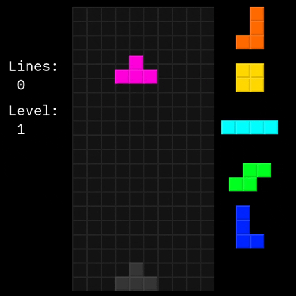
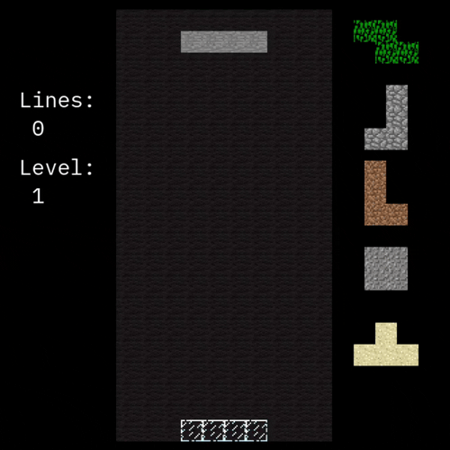

# tetris-the-third

This is a tetris clone, written in Rust, using SDL2 for graphics and input.





### Features
- local and online multiplayer (although online multiplayer requires port-forwarding)
- support for keyboard and gamepad controls
- customizable controls and theme (using `config.toml` file)
- marathon, sprint, and versus gamemodes (+ an experimental gamemode based on Conway's Game of Life)
- singleplayer game may be saved and restored

### How to build and run

- install make
- [install rust](https://www.rust-lang.org/tools/install)
- open a terminal and run the following commands:
```sh
git clone 'https://github.com/CyborgSquirrel/tetris-the-third'
cd tetris-the-third
make run
```

### Controls

The ui is navigated with the WASD keys by default.

The default keyboard controls for the first player are:
- <kbd>A</kbd> / <kbd>D</kbd> to move left / right
- <kbd>Q</kbd> / <kbd>E</kbd> to rotate left / right
- <kbd>S</kbd> to fall quicker
- <kbd>Space</kbd> to fall instantly
- <kbd>Tab</kbd> to swap falling piece with hold piece

The default keyboard controls for the second player are:
- <kbd>&#8592;</kbd> / <kbd>&#8594;</kbd> to move left / right
- <kbd>&#8593;</kbd> to rotate right
- <kbd>&#8595;</kbd> to fall quicker
- <kbd>RShift</kbd> to fall instantly
- <kbd>Enter</kbd> to swap falling piece with hold piece
